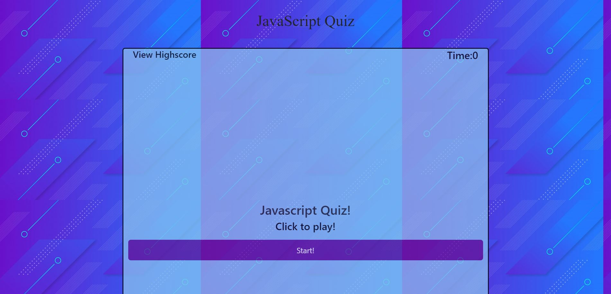

<a href="http://tonycrosby.net/04_web_api" target="_blank"></a>

# 04_web_api

> This is a Javascript quiz giving 5 questions with 4 choices to choose from and some true and false, when you answer a question wrong your time reduces and your score drops by 20pts.

### > To get to the Repository <a href="https://github.com/tonycrosby-tech/04_web_api"> Click this link </a>

### > To get to the Website <a href="https://github.com/tonycrosby-tech/04_web_api"> Click this link </a>

# Technologies Used

> HTML, Javascript, and Bootstrap

# Direction for future development

> Sounds for correct and incorrect answers, Correct answer text underneath correct, incorrect answers

# Acceptance Criteria

```
GIVEN I am taking a code quiz
WHEN I click the start button
THEN a timer starts and I am presented with a question
WHEN I answer a question
THEN I am presented with another question
WHEN I answer a question incorrectly
THEN time is subtracted from the clock
WHEN all questions are answered or the timer reaches 0
THEN the game is over
WHEN the game is over
THEN I can save my initials and score
```

## Thanks for checking out my quiz

## Tony Crosby